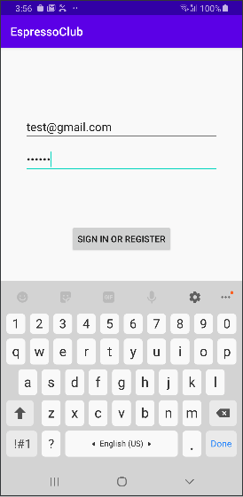
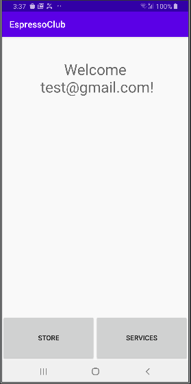

author: Oren Aviad
summary: Getting Started With Android Espresso
id: docs
categories: codelab,markdown
environments: Web
status: Published
feedback link: A link where users can go to provide feedback (Maybe the git repo)
analytics account: Google Analytics ID

# Getting Started With Android Espresso

## Welcome!

In this codelab you will learn how to write automation tests with Espresso: Android automated testing framework.

### What You’ll Learn 
- How to setup Espresso
- How to record Espresso Test, Save it & Run
- How to write Espreso Tests

### Prerequisites 
* Android Studio
* Android Device
* Source Control Tool: GitExtensions/Sourcetree

## App Overview

In this codelab you will modify the [EspressoClub](https://github.com/oaviad/espressoClub) project. You will setup Espresso and test app's functionality.

The <strong>EspressoClub</strong> app requires user's login, user has to enter valid credentials in the login screen (LoginActivity): valid email and valid password (>5 characters). After user has logged in, the main screen will be launched (MainActivity).

See figures below. 

 



## Getting Started

To get the sample app:

Clone the repository from GitHub and switch to the <strong>starter</strong> branch.

``` bash
$  git clone https://github.com/oaviad/espressoClub.git 
```

Positive
: <strong>Tip</strong>: Full solution is available on <strong>master</strong> branch.

## Task 1: setup Espresso

### Add Espresso dependencies

In your app's top-level build.gradle file, you need to specify these libraries as dependencies:

``` gradle

dependencies {
    androidTestImplementation 'androidx.test:core-ktx:1.2.0'
    androidTestImplementation 'androidx.test.ext:junit-ktx:1.1.1'
    androidTestImplementation 'androidx.test:runner:1.2.0'
    androidTestImplementation 'androidx.test:rules:1.2.0'
    androidTestImplementation 'androidx.test.espresso:espresso-core:3.2.0'
    androidTestImplementation 'androidx.test.espresso:espresso-intents:3.2.0'
    androidTestImplementation "com.google.truth:truth:0.44"
}
```

### Set the instrumentation runner

``` gradle
testInstrumentationRunner "androidx.test.runner.AndroidJUnitRunner"
```
Positive
: <strong>Tip</strong>: To learn more about <strong>Espresso Setup Instructions</strong>, you can read [here](https://developer.android.com/training/testing/espresso/setup). 

## Task 2: record login flow

To start recording a test with Espresso Test Recorder:

* Click Run > Record Espresso Test.

* In the Select Deployment Target window, choose the device on which you want to record the test. Click OK.

* Espresso Test Recorder triggers a build of your project, and the app must install and launch before Espresso Test Recorder allows you to interact with it. The Record Your Test window appears after the app launches. Interact with your device to start logging events such as "tap" and "type" actions.

* To save a recording: fill in <strong>Test class name</strong>, <strong>Test class language</strong> & click <strong>OK</strong>.

### Task instructions:

- Start recording
- Enter valid user credentials
- Click Sign In button
- Add one Assertion
- Save your recording to Kotlin class
- Verify tests generated, runs successfuly

Positive
: <strong>Tip</strong>: To learn more about <strong>Espresso Test Recorder</strong>, you can read [here](https://developer.android.com/studio/test/espresso-test-recorder).

## Task 3: validate user enters valid credentials

The main components of Espresso are:
* <strong>Espresso</strong>: Entry point to interactions with views (via onView() and onData()). Also exposes APIs that are not necessarily tied to any view, such as pressBack().
* <strong>ViewMatchers</strong>:  allows you to find a view in the current view hierarchy.
* <strong>ViewActions</strong>: allows you to perform actions on the views.
* <strong>ViewAssertions</strong>: allows you to assert the view state.

The following shows how all three expressions work together:

1. Use a ViewMatcher to find a View: onView(withId(R.id.my_view))
2. Use a ViewAction to perform an action: .perform(click())
3. Use a ViewAssertion to check if the result of the action matches an assertion: .check(matches(isDisplayed()))

### Task instructions:

- Create a new Test class
- Add the @RunWith(AndroidJUnit4::class) annotation at the beginning of your test class definition
- Add ActivityScenarioRule to launch the LoginActivity before the test starts and close it after the test:

Example:
``` kotlin
@get:Rule
val rule = activityScenarioRule<MyActivity>()
```

- Write a test that validates, when the user enters valid credentials, login button is enabled and welcome string contains the user name entered

Example:
``` kotlin
// onView statement
onView(withId(R.id.my_view))
    .perform(click())
    .check(matches(isDisplayed()))
    .check(matches(isEnabled()))
    .check(matches(not(isEnabled())))
// How to type text
onView(withId(R.id.my_editTextView)).perform(typeText(text), ViewActions.closeSoftKeyboard())
// How to check view text contains another string
onView(withId(R.id.my_textView)).check(matches(withText(containsString(str))))
```

Positive
: <strong>Tip</strong>: To see more examples, you can read [here](https://developer.android.com/training/testing/espresso/basics).

## Task 4: validate user enters invalid credentials

### Task instructions:

- Write a test that validates, when the user enters invalid credentials, login button is disabled and error popup is displayed with the correct error message

Example:
``` kotlin
// validate editText popup error text
rule.scenario.onActivity {
  Truth.assertThat(it.my_editText.error).isEqualTo(getString(R.string.my_str))
}
```

## Task 5: validate login Intent

### Task instructions:

- Create a new Test class
- Add the @RunWith(AndroidJUnit4::class) annotation at the beginning of your test class definition
- Add IntentsTestRule to initialize Espresso-Intents before each test and release Espresso-Intents after each test run

Example:
``` kotlin
@get:Rule
val rule = IntentsTestRule(MyActivity::class.java)
```

- Write a test that validates, when the user enters valid credentials and clicks the login button, a new Intent was sent with the MainActivity component and with an extra named “displayName” containing the user name entered

Example:
``` kotlin
// Verify intent component
Intents.intended(IntentMatchers.hasComponent(MyActivity::class.java.name))
// Verify intent extra
Intents.intended(IntentMatchers.hasExtra(extra_name, extra_value))
```

## Task 6: setup Intent before launching Activity

### Task instructions:

- Create a new Test class
- Add the @RunWith(AndroidJUnit4::class) annotation at the beginning of your test class definition
- Add ActivityScenario to launch MainActivity:

Example:
``` kotlin
lateinit var scenario: ActivityScenario<MyActivity>
```
- Launch the MainActivity only after you setup the Intent with a long display name.

Example:
``` kotlin
// Setup intent
val intent = Intent(ApplicationProvider.getApplicationContext(), MyActivity::class.java)
intent.putExtra(extra_name, extra_value)
// Launch the activity
scenario = launchActivity(intent)
```
- Clean up in an @After annotated method

Example:
``` kotlin
@After
fun cleanup() {
  scenario.close()
}
```

## Resources

- [Espresso cheat-sheet](https://developer.android.com/training/testing/espresso/cheat-sheet)
- [Espresso Basics](https://developer.android.com/training/testing/espresso/basics)
- [Espresso Test Recorder](https://developer.android.com/studio/test/espresso-test-recorder)
- [A Deep Dive into Android Espresso](https://medium.com/att-israel/a-deep-dive-into-android-espresso-3feed15d204c)
